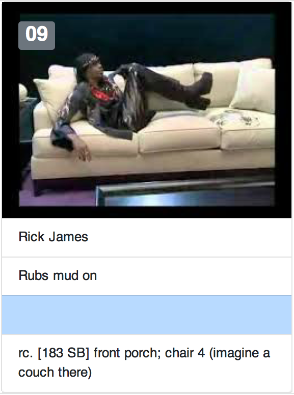
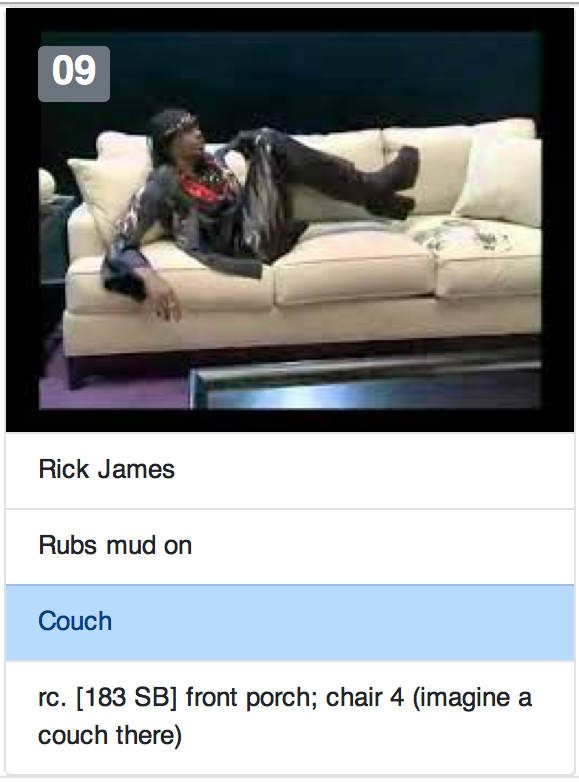

# anki_styles
This is a themed Anki template for memorizing PAO (person, action, objects) lists.  It's based on twitter bootstrap.

It has cards to quiz you on *each* element.

# Screenshots
 

# How to install
1. Import the deck PAO_Bootstrap.apkg
2. Copy the files within the media folder into your media.collections folder. 
   * See [this section](https://apps.ankiweb.net/docs/manual.html#files) of the Anki manual to find your collections.media folder.
   * On a mac it's in ~/Library/Application Support/Anki2
   * Only copy the individual files within "media" into "media.collections"
  
# Tips
* Create your deck and fill in the fields ...
* Only put one picture in the "Picture" field.  
* Pictures with landscape orientation work best.
